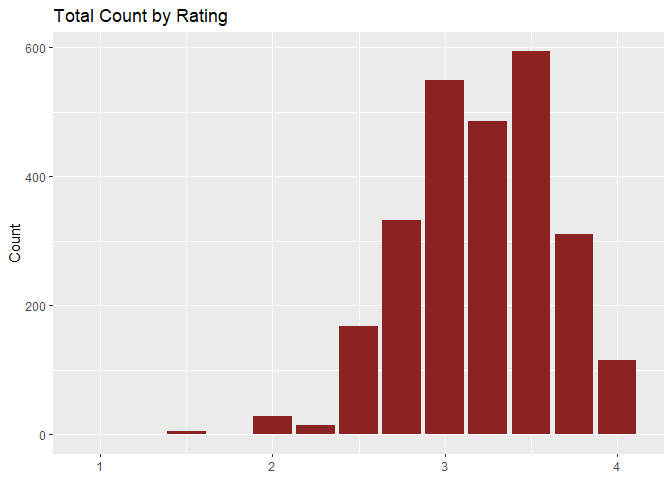
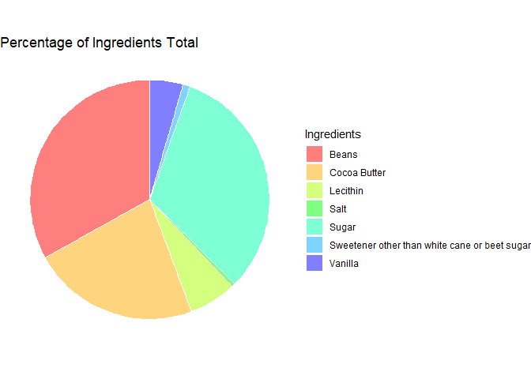
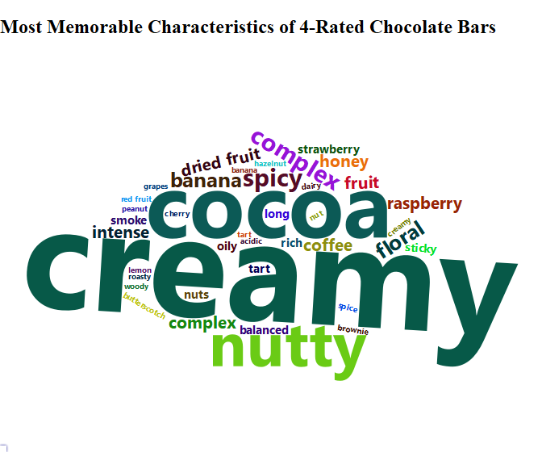

Flavors of Cacao Analysis
================
Leopoldine Mirtil

### Data Source

The data used in this analysis is from the “Flavors of Cacao” database,
made publicly available by Brady Brelinski, [link
here](https://flavorsofcacao.com/chocolate_database.html) and was last
updated March 3, 2024 at time of analysis. It contains the ratings of
nearly 2,700 dark chocolate bars.

### Tasks

1.  Determine the total amount of chocolate bars reviewed each year
2.  Identify the overall highest and lowest-rated chocolate bars
3.  Determine the total ingredient count
4.  Determine the companies and bean origin countries of the highest
    rated bars
5.  Identify the characteristics of the most recent years’ highest
    4-Rated chocolate bars

### Step 1: Import Data

#### Load Library

``` r
#for data manipulation
library(dplyr)
library(lubridate)
library(tidyr)
library(tidyverse)
library(readxl)

#for visualizations
library(ggplot2)
library(RColorBrewer)
library(wordcloud2)

#for documentation/markdown
library(knitr)
```

#### Import Data

### Step 2 - Clean & Inspect Data

#### Check for Missing/NA Values

``` r
sapply(cacao_df, function(x) sum(is.na(x)))
```

    ##                              REF           Company (Manufacturer) 
    ##                                0                                0 
    ##                 Company Location                      Review Date 
    ##                                0                                0 
    ##           Country of Bean Origin Specific Bean Origin or Bar Name 
    ##                                0                                0 
    ##                    Cocoa Percent                      Ingredients 
    ##                                0                               87 
    ##   Most Memorable Characteristics                           Rating 
    ##                                0                                0

#### Check for Empty Values

``` r
sapply(cacao_df, function(x) sum(x==""))
```

    ##                              REF           Company (Manufacturer) 
    ##                                0                                0 
    ##                 Company Location                      Review Date 
    ##                                0                                0 
    ##           Country of Bean Origin Specific Bean Origin or Bar Name 
    ##                                0                                0 
    ##                    Cocoa Percent                      Ingredients 
    ##                                0                               NA 
    ##   Most Memorable Characteristics                           Rating 
    ##                                0                                0

#### Remove Data

``` r
#remove rows w/ missing/NA values
cacao_df <- drop_na(cacao_df)

#confirm removal
sapply(cacao_df, function(x) sum(is.na(x)))
```

    ##                              REF           Company (Manufacturer) 
    ##                                0                                0 
    ##                 Company Location                      Review Date 
    ##                                0                                0 
    ##           Country of Bean Origin Specific Bean Origin or Bar Name 
    ##                                0                                0 
    ##                    Cocoa Percent                      Ingredients 
    ##                                0                                0 
    ##   Most Memorable Characteristics                           Rating 
    ##                                0                                0

#### Modify Ingredient Column

``` r
#split ingredient columns: number & letters
cacao_df <- cacao_df %>% 
        separate(Ingredients, c('Ingredient Nums', 'Ingredients'), "-") 

#change data type of ingr nums
cacao_df$'Ingredient Nums' <- as.numeric(cacao_df$'Ingredient Nums')

#trim white space from ingredient (letters)
cacao_df$Ingredients <- str_trim(cacao_df$Ingredients)
 
#create dict for ingredients 
ingrd_dict <-  c('B'='Beans', 'S'='Sugar', 'S*'='Sweetener other than white cane or beet sugar', 
        'C'='Cocoa Butter', 'V'='Vanilla', 'L'='Lecithin','Sa'='Salt')


#replace ingredients letters using dictionary
cacao_df$Ingredients <- sapply(strsplit(cacao_df$Ingredients, ',\\s?'), function(x){paste(unlist(as.list(ingrd_dict)[x]), collapse = ',')})
```

#### View Modified Dataframe

``` r
str(cacao_df)
```

    ## tibble [2,606 × 11] (S3: tbl_df/tbl/data.frame)
    ##  $ REF                             : num [1:2606] 2542 2546 2542 2546 2454 ...
    ##  $ Company (Manufacturer)          : chr [1:2606] "5150" "5150" "5150" "5150" ...
    ##  $ Company Location                : chr [1:2606] "U.S.A." "U.S.A." "U.S.A." "U.S.A." ...
    ##  $ Review Date                     : num [1:2606] 2021 2021 2021 2021 2019 ...
    ##  $ Country of Bean Origin          : chr [1:2606] "India" "Uganda" "Fiji" "Venezuela" ...
    ##  $ Specific Bean Origin or Bar Name: chr [1:2606] "Anamalai, batch 1" "Semuliki Forest, batch 1" "Matasawalevu, batch 1" "Sur del Lago, batch 1" ...
    ##  $ Cocoa Percent                   : num [1:2606] 0.68 0.8 0.68 0.72 0.76 0.76 0.76 0.78 0.78 0.7 ...
    ##  $ Ingredient Nums                 : num [1:2606] 3 3 3 3 3 3 3 2 2 3 ...
    ##  $ Ingredients                     : chr [1:2606] "Beans,Sugar,Cocoa Butter" "Beans,Sugar,Cocoa Butter" "Beans,Sugar,Cocoa Butter" "Beans,Sugar,Cocoa Butter" ...
    ##  $ Most Memorable Characteristics  : chr [1:2606] "milk brownie, macadamia,chewy" "mildly bitter, basic cocoa, fatty" "chewy, off, rubbery" "fatty, earthy, moss, nutty,chalky" ...
    ##  $ Rating                          : num [1:2606] 3.5 3.25 3 3 3.75 3.5 3.25 3 2.75 2.5 ...

### Step 3: Analysis

#### Descriptive Analysis

``` r
summary(cacao_df)
```

    ##       REF       Company (Manufacturer) Company Location    Review Date  
    ##  Min.   :   5   Length:2606            Length:2606        Min.   :2006  
    ##  1st Qu.: 891   Class :character       Class :character   1st Qu.:2012  
    ##  Median :1556   Mode  :character       Mode  :character   Median :2015  
    ##  Mean   :1537                                             Mean   :2015  
    ##  3rd Qu.:2222                                             3rd Qu.:2018  
    ##  Max.   :2876                                             Max.   :2023  
    ##  Country of Bean Origin Specific Bean Origin or Bar Name Cocoa Percent   
    ##  Length:2606            Length:2606                      Min.   :0.4200  
    ##  Class :character       Class :character                 1st Qu.:0.7000  
    ##  Mode  :character       Mode  :character                 Median :0.7000  
    ##                                                          Mean   :0.7146  
    ##                                                          3rd Qu.:0.7400  
    ##                                                          Max.   :1.0000  
    ##  Ingredient Nums Ingredients        Most Memorable Characteristics
    ##  Min.   :1.000   Length:2606        Length:2606                   
    ##  1st Qu.:2.000   Class :character   Class :character              
    ##  Median :3.000   Mode  :character   Mode  :character              
    ##  Mean   :3.023                                                    
    ##  3rd Qu.:4.000                                                    
    ##  Max.   :6.000                                                    
    ##      Rating     
    ##  Min.   :1.000  
    ##  1st Qu.:3.000  
    ##  Median :3.250  
    ##  Mean   :3.211  
    ##  3rd Qu.:3.500  
    ##  Max.   :4.000

#### Unique Value Count of All Columns

``` r
cacao_df %>%
  select(`Company (Manufacturer)`, `Review Date`, `Country of Bean Origin`, `Specific Bean Origin or Bar Name`, `Cocoa Percent`) %>%
  sapply(function(x) length(unique(x)))
```

    ##           Company (Manufacturer)                      Review Date 
    ##                              578                               18 
    ##           Country of Bean Origin Specific Bean Origin or Bar Name 
    ##                               64                             1682 
    ##                    Cocoa Percent 
    ##                               47

#### Total Chocolate Bars Count by Rating

``` r
cacao_df %>%
  select(Rating) %>%
  group_by(Rating) %>%
  summarise(count=n()) %>%
  arrange(desc(Rating))
```

    ## # A tibble: 12 × 2
    ##    Rating count
    ##     <dbl> <int>
    ##  1   4      115
    ##  2   3.75   311
    ##  3   3.5    594
    ##  4   3.25   486
    ##  5   3      549
    ##  6   2.75   333
    ##  7   2.5    168
    ##  8   2.25    14
    ##  9   2       29
    ## 10   1.75     1
    ## 11   1.5      5
    ## 12   1        1

#### Total Chocolate Bars Count by Year

``` r
cacao_df %>%
  select(`Review Date`) %>%
  group_by(`Review Date`) %>%
  summarise(totalCount=n()) %>%
  arrange(desc(`Review Date`))
```

    ## # A tibble: 18 × 2
    ##    `Review Date` totalCount
    ##            <dbl>      <int>
    ##  1          2023         69
    ##  2          2022         98
    ##  3          2021        174
    ##  4          2020         81
    ##  5          2019        192
    ##  6          2018        225
    ##  7          2017        103
    ##  8          2016        213
    ##  9          2015        279
    ## 10          2014        243
    ## 11          2013        177
    ## 12          2012        180
    ## 13          2011        153
    ## 14          2010         94
    ## 15          2009        113
    ## 16          2008         84
    ## 17          2007         68
    ## 18          2006         60

#### Total Ingredient Count

``` r
cacao_df %>%
  select(Ingredients) %>%
  group_by(Ingredients) %>%
  separate_longer_delim(c(Ingredients), delim=",") %>%
  summarise(Total=n()) %>%
  arrange(desc(Total))
```

    ## # A tibble: 7 × 2
    ##   Ingredients                                   Total
    ##   <chr>                                         <int>
    ## 1 Beans                                          2606
    ## 2 Sugar                                          2522
    ## 3 Cocoa Butter                                   1780
    ## 4 Lecithin                                        504
    ## 5 Vanilla                                         353
    ## 6 Sweetener other than white cane or beet sugar    77
    ## 7 Salt                                             37

#### Highest Rated Chocolate Bar(s)

``` r
cacao_df %>%
  select(`Specific Bean Origin or Bar Name`, Rating) %>%
  filter(Rating == max(Rating)) %>%
  group_by(`Specific Bean Origin or Bar Name`) %>%
  arrange(`Specific Bean Origin or Bar Name`) %>%
  slice_head(n=1) 
```

    ## # A tibble: 106 × 2
    ## # Groups:   Specific Bean Origin or Bar Name [106]
    ##    `Specific Bean Origin or Bar Name`               Rating
    ##    <chr>                                             <dbl>
    ##  1 ABOCFA Coop                                           4
    ##  2 Alto Beni, Cru Savage                                 4
    ##  3 Arauca                                                4
    ##  4 Asante                                                4
    ##  5 Bachelor's Hall E., St. Thomas Parish, batch bh1      4
    ##  6 Bali, Sukrama Bros. Farm, Melaya, 62hr C              4
    ##  7 Bejofo, 2019 H., Batch 20                             4
    ##  8 Bejofo, Sambirano V., Akesson E.                      4
    ##  9 Bellavista Coop, #225, LR, MC, CG Exclusive           4
    ## 10 Ben Tre, batch BEN210924 8983                         4
    ## # ℹ 96 more rows

#### Lowest Rated Chocolate Bar(s)

``` r
cacao_df %>%
  select(`Specific Bean Origin or Bar Name`, Rating) %>%
  filter(Rating == min(Rating)) 
```

    ## # A tibble: 1 × 2
    ##   `Specific Bean Origin or Bar Name` Rating
    ##   <chr>                               <dbl>
    ## 1 Dark                                    1

#### Bean Origin Countries of 4-Rated Bars

``` r
cacao_df %>%
  select(`Country of Bean Origin`, Rating) %>%
  filter(Rating == max(Rating)) %>%
  group_by(`Country of Bean Origin`) %>%
  summarise(count=n()) %>%
  arrange(desc(count))
```

    ## # A tibble: 25 × 2
    ##    `Country of Bean Origin` count
    ##    <chr>                    <int>
    ##  1 Peru                        20
    ##  2 Venezuela                   20
    ##  3 Madagascar                  11
    ##  4 Ecuador                      9
    ##  5 Blend                        7
    ##  6 Bolivia                      5
    ##  7 Brazil                       5
    ##  8 Colombia                     5
    ##  9 Mexico                       5
    ## 10 Papua New Guinea             4
    ## # ℹ 15 more rows

#### Companies of Highest-Rated Chocolate Bar(s)

``` r
cacao_df %>%
  select(`Company (Manufacturer)`, Rating) %>%
  filter(Rating == max(Rating)) %>%
  group_by(`Company (Manufacturer)`) %>%
  slice_head(n = 1) %>%
  arrange(`Company (Manufacturer)`)
```

    ## # A tibble: 53 × 2
    ## # Groups:   Company (Manufacturer) [53]
    ##    `Company (Manufacturer)` Rating
    ##    <chr>                     <dbl>
    ##  1 A. Morin                      4
    ##  2 AMMA                          4
    ##  3 Amano                         4
    ##  4 Arete                         4
    ##  5 Artisan du Chocolat           4
    ##  6 Bar Au Chocolat               4
    ##  7 Benoit Nihant                 4
    ##  8 Beschle (Felchlin)            4
    ##  9 Bonnat                        4
    ## 10 Brasstown                     4
    ## # ℹ 43 more rows

#### Most Recent Years Analysis

##### 2023 Highest Rated Chocolate Bar(s)

``` r
cacao_df %>%
  select(`Specific Bean Origin or Bar Name`, `Review Date`, Rating, `Company (Manufacturer)`, `Country of Bean Origin`) %>%
  filter((`Review Date`==max(`Review Date`)) & (Rating==max(Rating)))
```

    ## # A tibble: 1 × 5
    ##   `Specific Bean Origin or Bar Name` `Review Date` Rating Company (Manufacture…¹
    ##   <chr>                                      <dbl>  <dbl> <chr>                 
    ## 1 "Salitral, \"Desert Criollo\""              2023      4 Castronovo            
    ## # ℹ abbreviated name: ¹​`Company (Manufacturer)`
    ## # ℹ 1 more variable: `Country of Bean Origin` <chr>

##### 2023 Lowest Rated Chocolate Bar(s)

``` r
cacao_df %>%
  select(`Specific Bean Origin or Bar Name`, `Review Date`, Rating, `Company (Manufacturer)`, `Country of Bean Origin`) %>%
  filter(`Review Date`==max(`Review Date`)) %>%
  filter(Rating==min(Rating))
```

    ## # A tibble: 6 × 5
    ##   `Specific Bean Origin or Bar Name` `Review Date` Rating Company (Manufacture…¹
    ##   <chr>                                      <dbl>  <dbl> <chr>                 
    ## 1 Ben Tre                                     2023    2.5 2U                    
    ## 2 Sambirano Valley, batch 0013                2023    2.5 Chocolate Thunder     
    ## 3 Chaparral, batch 0004                       2023    2.5 Chocolate Thunder     
    ## 4 Chuao, harvest 2020                         2023    2.5 Chokola               
    ## 5 Haiti                                       2023    2.5 Ethereal              
    ## 6 Hainan                                      2023    2.5 slowww melt           
    ## # ℹ abbreviated name: ¹​`Company (Manufacturer)`
    ## # ℹ 1 more variable: `Country of Bean Origin` <chr>

##### Characteristics of 2023 Highest-Rated Bars

``` r
cacao_df %>%
  select(`Specific Bean Origin or Bar Name`, `Most Memorable Characteristics`, Rating) %>%
  filter(Rating== max(Rating)) %>%
  group_by(`Specific Bean Origin or Bar Name`) %>%
  arrange(`Specific Bean Origin or Bar Name`, `Most Memorable Characteristics`) %>%
  group_by(`Most Memorable Characteristics`) %>%
  separate_longer_delim(c(`Most Memorable Characteristics`), delim=",") %>%
  select(`Most Memorable Characteristics`) %>%
  summarize(count=n()) %>%
  arrange(desc(count)) 
```

    ## # A tibble: 163 × 2
    ##    `Most Memorable Characteristics` count
    ##    <chr>                            <int>
    ##  1 "creamy"                            35
    ##  2 " cocoa"                            22
    ##  3 " nutty"                            15
    ##  4 " spicy"                             6
    ##  5 "complex"                            6
    ##  6 " floral"                            5
    ##  7 "banana"                             5
    ##  8 " coffee"                            4
    ##  9 " complex"                           4
    ## 10 " dried fruit"                       4
    ## # ℹ 153 more rows

##### Characteristics of 2023 Lowest-Rated Bars

``` r
cacao_df %>%
  select(`Specific Bean Origin or Bar Name`, `Most Memorable Characteristics`, Rating) %>%
  filter(Rating == min(Rating)) %>%
  group_by(`Specific Bean Origin or Bar Name`) %>%
  arrange(`Specific Bean Origin or Bar Name`, `Most Memorable Characteristics`) %>%
  group_by(`Most Memorable Characteristics`) %>%
  separate_longer_delim(c(`Most Memorable Characteristics`), delim=",") %>%
  select(`Most Memorable Characteristics`) %>%
  summarize(count=n()) %>%
  arrange(desc(count))
```

    ## # A tibble: 2 × 2
    ##   `Most Memorable Characteristics` count
    ##   <chr>                            <int>
    ## 1 " strong off flavor"                 1
    ## 2 "pastey"                             1

### Step 4: Visualization

<!-- -->

<!-- -->

<!-- -->
